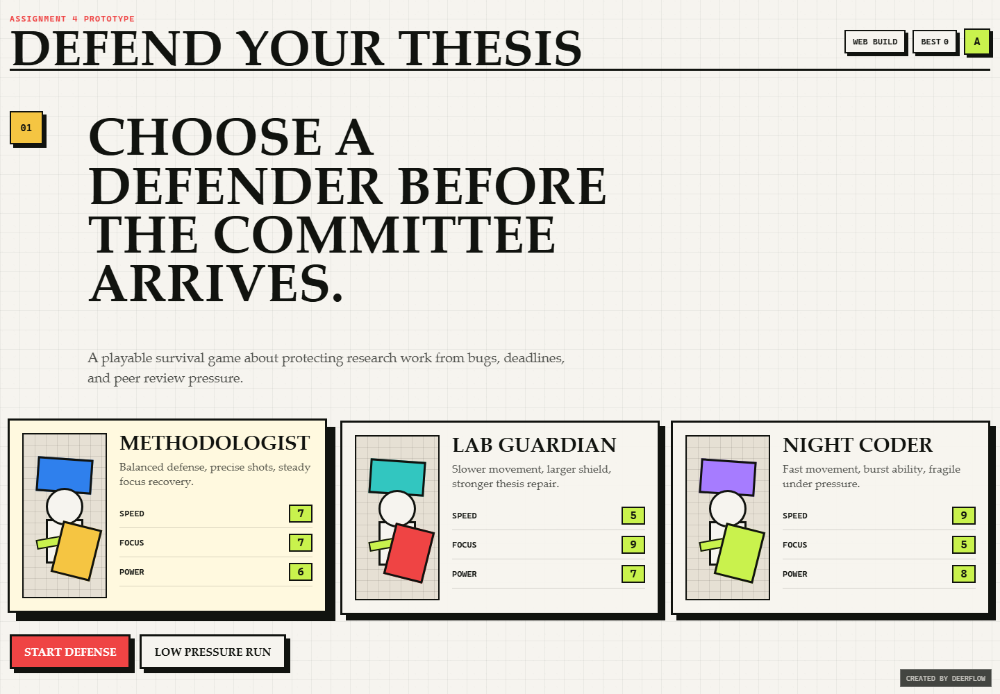
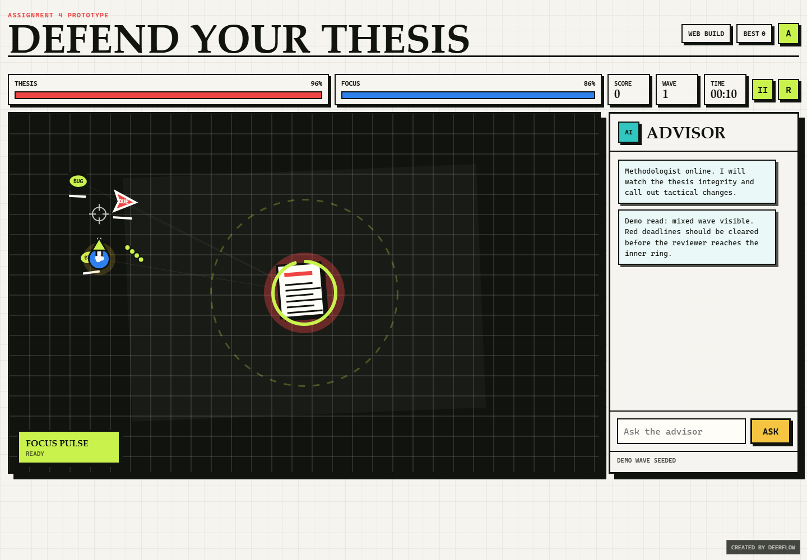

# Assignment 4 Report: Defend Your Thesis

**Student:** TODO: fill in name  
**Course:** TODO: fill in course name  
**Project Option:** Option A, "Defend Your Thesis"  
**Demo URL:** https://zyibo834-ai.github.io/my-blog/assignment4/  
**Local Entry:** `index.html`  
**Windows Executable:** `dist/DefendYourThesis_Windows.exe`

## 1. Background & Design

This project revives the in-class "Defend Your Thesis" idea as a stable, playable browser game. The player acts as a graduate student protecting a thesis document from academic threats: Bugs, Deadlines, and Peer Reviewers. I chose this option because it converts a humorous classroom prompt into an actual software artifact with clear mechanics, user interaction, and measurable results.

The core design goal is simple: protect the thesis for as long as possible while clearing threats and increasing the score. The game begins with a character selection screen. Each character has a different balance of movement speed, focus recovery, shot power, and special ability:

- **Methodologist:** balanced movement and a "Focus Pulse" area-control skill.
- **Lab Guardian:** slower movement, stronger defense, and a thesis shield skill.
- **Night Coder:** faster movement, lower focus capacity, and a radial burst skill.

The visual design uses a paper-grid academic style mixed with hard-edged arcade UI. The thesis is represented as a central document, while enemies approach from the screen edges. This makes the game readable during presentation and keeps the metaphor visible on the first screen.

## 2. Tech Stack

| Category | Choice |
|---|---|
| Hardware | Standard Windows laptop/desktop |
| Development OS | Windows, PowerShell environment |
| Runtime Target | Modern browser: Chrome, Edge, Firefox, Safari |
| Languages | HTML, CSS, JavaScript |
| Rendering | HTML5 Canvas |
| App Type | Static website + PWA |
| Packaging | Windows IExpress self-extracting executable |
| AI Models/Tools | GPT-5/Codex as the primary LLM development partner |

The application does not require a backend server. It can be hosted as a static website, which satisfies the "stable URL" delivery requirement. It also includes a `manifest.webmanifest` and `sw.js` service worker, so the app can be installed or cached when served over HTTP/HTTPS.

## 3. Functional Requirements

| Requirement | Implementation |
|---|---|
| Functional software | The game runs in a browser from `index.html`. |
| Character selection | Three playable defenders are implemented. |
| Game over/score logic | Score, wave, survival time, kills, high score, and game-over modal are implemented. |
| Keyboard/mouse controls | WASD/arrow movement, mouse/touch aiming, shooting, pause, restart, and special ability controls are implemented. |
| Stable URL or executable | Static website files can be deployed to any static hosting service; a Windows `.exe` package is also included. |
| AI-assisted development documentation | This report documents planning, implementation, debugging, and hallucination handling. |

## 4. Bonus Features

**Integrated AI Agent (+3):** The game includes an in-game "Advisor" panel. It gives tactical tips based on game state, such as low thesis integrity, low focus, deadline clusters, and reviewer clusters. It also responds to typed questions about score, focus, thesis integrity, enemies, and character strategy. The current implementation is rule-based rather than connected to a paid API, so it remains offline and reliable during presentation.

**Cross-Platform Support (+2):** The main version is a static web/PWA app. It runs on Windows, macOS, Linux, and mobile browsers. The Windows `.exe` is included only as an additional local packaging option.

## 5. Development Log

### 5.1 Architecture Planning With AI

Prompt summary:

```text
Help me complete Assignment 4. Build a playable "Defend Your Thesis" game with character selection, score/game-over logic, controls, and documentation.
```

AI-assisted decisions:

- Use a static HTML/CSS/JavaScript architecture to avoid dependency and installation problems.
- Use Canvas for fast 2D rendering and collision detection.
- Separate the project into `index.html`, `styles.css`, and `game.js`.
- Add a service worker and manifest for PWA-style website deployment.
- Create report screenshots with a headless browser.

Why this architecture worked:

- The assignment requires a compiled executable or stable URL. A static website is the simplest route to a stable URL.
- A browser game is naturally cross-platform.
- Avoiding third-party game engines reduced setup risk for classroom presentation.

### 5.2 Implementing Core Mechanics With AI

Prompt summary:

```text
Implement the Canvas game loop, player movement, aiming, shooting, enemies, collision detection, waves, score, and game over.
```

Implemented systems:

- `requestAnimationFrame` game loop.
- Player movement with WASD/arrow keys.
- Mouse/touch aiming and shooting.
- Enemy spawning from screen edges.
- Collision detection using circle distance checks.
- Thesis health and focus meters.
- Wave scaling over time.
- High score storage with `localStorage`.

Important code areas:

- Player and shooting logic: `updatePlayer()` and `fireProjectile()` in `game.js`.
- Enemy behavior: `spawnEnemy()` and `updateEnemies()` in `game.js`.
- Collision and score logic: `updateProjectiles()` and `killEnemy()` in `game.js`.
- Game-over logic: `endGame()` in `game.js`.

### 5.3 Adding the AI Advisor

Prompt summary:

```text
Add a live AI assistant panel that reacts to game state and can answer typed gameplay questions.
```

Implementation:

- The Advisor watches internal game variables such as thesis health, focus, wave number, enemy counts, and enemy types.
- It posts short tactical messages when the situation changes.
- The text input calls `answerAdvisorQuestion()`, which returns a contextual response.

This satisfies the bonus idea of a live assistant without depending on an external API key or network connection.

### 5.4 Handling AI Hallucinations and Broken Assumptions

During development, several assumptions had to be corrected:

- **Executable packaging assumption:** The AI first checked for PyInstaller, Electron, npm packages, and the .NET SDK. These were not available or incomplete in the environment. The solution was to keep the app as a static website and use Windows IExpress for a simple `.exe` package.
- **Headless browser screenshot issue:** Chrome and Edge initially failed in the sandbox because crash reporting could not access its default path. The fix was to rerun headless Chrome with explicit user-data directories and elevated permission.
- **Screenshot quality issue:** The first gameplay screenshot captured an empty beginning state. A `?demo=game` URL mode was added so the screenshot could show real enemies, projectiles, thesis health, and Advisor output.
- **Responsive layout issue:** The first character selection screenshot showed the description text in a narrow column. CSS grid placement was corrected so the description aligns under the main heading.

These corrections show that AI suggestions were treated as drafts and verified through actual execution rather than trusted blindly.

## 6. Results

The final project includes:

- A complete character selection page.
- A playable defense/survival game.
- Score, wave, timer, thesis health, focus, high score, pause, restart, and game-over UI.
- Integrated Advisor panel.
- Static website/PWA deployment support.
- Screenshots for documentation.
- Windows `.exe` package.

### Screenshot 1: Character Selection



### Screenshot 2: Gameplay



## 7. How to Deploy as a Website

Upload the following files/folders to a static hosting service:

```text
index.html
styles.css
game.js
manifest.webmanifest
sw.js
assets/
screenshots/
```

For my existing GitHub Pages website, the project should be placed in an `assignment4` folder under the site repository. The final URL is:

```text
https://zyibo834-ai.github.io/my-blog/assignment4/
```

## 8. Conclusion

This project demonstrates how LLMs can support software engineering beyond simple prompting. AI helped plan the architecture, generate implementation drafts, debug environment issues, improve UI layout, create screenshots, and document the development process. The final result is a stable, playable application that can be submitted either as a website or as a Windows executable package.
